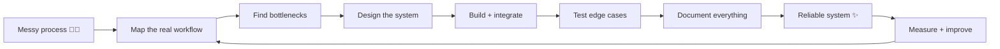

<div align="center">

# 👋 Hi, I'm Janna Wong

### AI Automation & Systems Architect


<br/>

[](https://janrswong.com)
[](mailto:janrswong+inquiry@gmail.com)

<br/>

`AI Automation` · `Systems Architecture` · `Integrations` · `Internal Tools` · `Web Apps`

</div>

---

## 🕹️ Choose your path

<table>
<tr>
<td width="33%" align="center">

### 👀 I'm a recruiter

Want the fast version?

**AI systems + automation + technical ownership.**

[→ See my portfolio](https://janrswong.com)

</td>
<td width="33%" align="center">

### 🚀 I'm building a company

Need workflows, AI, integrations, or internal systems that actually work?

[→ See what I build](https://janrswong.com/projects)

</td>
<td width="33%" align="center">

### 🤓 I'm technical

Want architecture, stack, systems thinking, and implementation details?

**Keep scrolling ↓**

</td>
</tr>
</table>

---

## `janna@systems:~$ whoami`

```text
> role             AI Automation & Systems Architect
> mode             systems thinker + builder
> favorite_problem "this process is a mess"
> response         map → simplify → automate → test → document
> communication    async-first
> status           designing systems that remove operational chaos
```

I build the layer between **business problems and working technical systems**.

That usually means taking scattered tools, repetitive manual work, disconnected data, fuzzy processes, and AI ideas — then turning them into something structured, dependable, and usable.

---

## ⚡ Things I like building

<details open>
<summary><b>🤖 AI systems & intelligent workflows</b></summary>
<br/>

- AI agents and LLM-powered workflows
- Research, summarization, classification, enrichment, and decision-support systems
- RAG and knowledge-base workflows
- Prompt pipelines, structured outputs, evaluation, and guardrails
- Human-in-the-loop AI operations

</details>

<details>
<summary><b>🔁 Automation & integrations</b></summary>
<br/>

- n8n, Make, Zapier, and Google Apps Script automations
- API and webhook integrations
- CRM, SaaS, Google Workspace, and operational tool connections
- Event-driven workflows and background processes
- Error handling, retries, logs, QA, and maintainable handoffs

</details>

<details>
<summary><b>🧠 Internal platforms & operational systems</b></summary>
<br/>

- Admin panels and internal tools
- Dashboards and reporting systems
- Workflow management and structured handoffs
- Supabase/PostgreSQL-backed applications
- Documentation, SOPs, implementation guides, and technical architecture

</details>

<details>
<summary><b>🌐 Web applications</b></summary>
<br/>

- Next.js / React applications
- TypeScript and Node.js services
- Authentication, databases, APIs, and CMS workflows
- Cloudflare and Vercel deployments
- Production systems designed to be maintainable after launch

</details>

---

## 🧩 My system-building loop



> My goal isn't to automate everything. It's to automate the **right things**, keep humans where judgment matters, and make the whole system easier to operate.

---

## 🛠️ Current toolbox

### 🤖 AI & Automation


### 💻 Engineering


### ☁️ Data & Infrastructure


---

## 🎮 Tiny interactive challenge

<details>
<summary><b>Click me: Your team spends 12 hours/week copying data between 4 tools. What do I do first?</b></summary>
<br/>

❌ Not: immediately open n8n and start connecting nodes.

✅ First: map the process, identify the source of truth, understand why each handoff exists, define failure states, and decide what **should** be automated.

Then we build.

</details>

<details>
<summary><b>Click me: Someone says “Can we just add AI to this?”</b></summary>
<br/>

My next questions are usually:

1. What decision or task are we improving?
2. What context does the model need?
3. What does a correct output look like?
4. What happens when the model is wrong?
5. Does AI actually improve this versus deterministic logic?

**AI is a component, not the architecture.**

</details>

<details>
<summary><b>Click me: The automation works... until nobody remembers how it works.</b></summary>
<br/>

That's why documentation is part of the build — not something we promise to do later.

I care about:

`architecture` → `ownership` → `error handling` → `testing` → `runbooks` → `handover`

</details>

---

## 🧠 Current professional focus

```text
01  AI automation & intelligent operational workflows
02  Systems architecture & integration design
03  AI-enabled internal platforms & research tools
04  RAG, knowledge systems & structured AI workflows
05  Dashboards, admin systems & reporting
06  API-first & event-driven integrations
07  Production-ready web apps & internal tooling
08  Technical consulting & fractional systems leadership
```

---

## ✨ How I like to work

```diff
+ clear scope and success metrics
+ async-first communication
+ written specs and documentation
+ access to the right tools and stakeholders
+ thoughtful architecture
+ testing before "done"
+ systems people can actually maintain

- mystery requirements
- fragile automations nobody owns
- rushing straight into tools without understanding the process
- "we'll document it later"
```

---

## 🌐 Want the polished version?

<div align="center">

### My GitHub is the workshop.  
### **[janrswong.com](https://janrswong.com) is the showroom.**

Explore case studies, services, systems work, web applications, resources, and more.

<br/>

[](https://janrswong.com)

</div>

---

<details>
<summary><b>🥚 You found the tiny GitHub easter egg</b></summary>
<br/>

If you've scrolled this far, we probably both care too much about how systems work.

That is usually a good sign. 😄

**Say hi:** [janrswong+inquiry@gmail.com](mailto:janrswong+inquiry@gmail.com)

</details>

<br/>

<div align="center">

`build thoughtfully` · `automate intentionally` · `document relentlessly`

</div>
